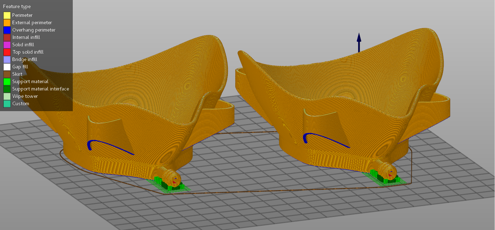
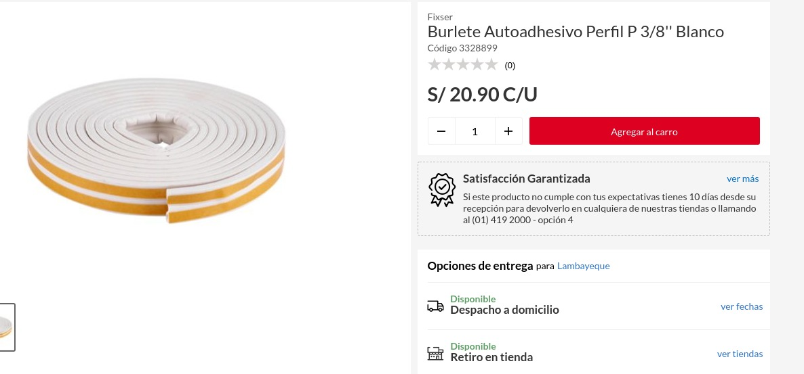
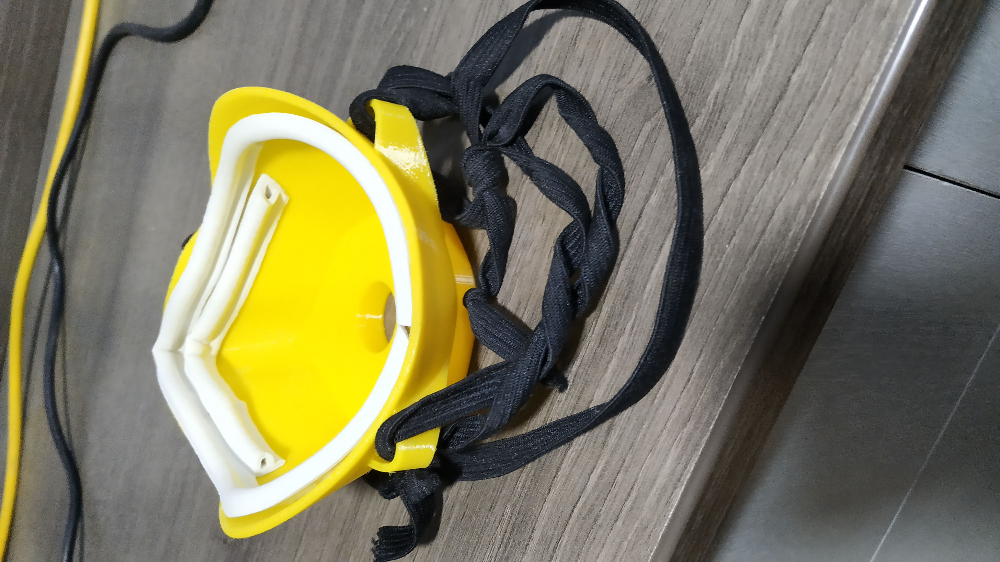

# Mask Body

The mask body can be printed using a standard FDM printer. The attachment points have a 30deg overhang, so your printer needs to be able to achieve this *somewhat* reliably.

## Supports
The only part that absolutely requires supports is the manometer port, but most slicers should allow you to select this portion for supports fairly easiy.

## Materials

### Plastic
While PLA doesn't present a health hazard, it will be less durable in a medical environment due to the increased moisture it will absorb from the patient's breath. 

Ideally the mask should be printed in PETG or ABS.

### Gasket / Seal
The seal around the face is accomplished by applying self-adhesive weather stripping (burlete in Spanish) around the perimeter of the mask. This should be of the hollow variety that will provide comfort to the user.

The stripping should be applied as close to the edge of the mask as possible in order to provide a good seal. A double row is needed in the nose area.

### Banding
A doubled 1cm elastic band is *barely* sufficient to provide a decent seal. Research is needed into materials that are readily available, comfortable to wear for extended periods, and fairly higenic. 