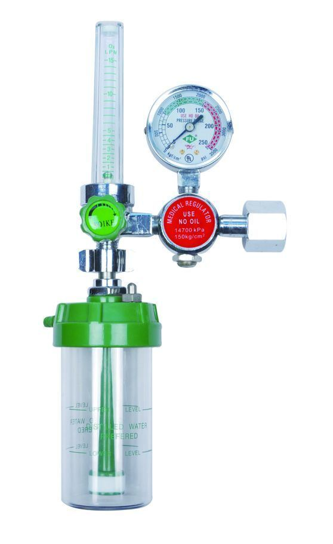

# Equipment

Ideally, testing would be performed with a standard medical oxigen tank, regulator, and humidifier similar to this one:

In the absence of real equipment, the following may be substituted with care to match the characteristics of medical equipment.

## Air Supply

Air compressor with regulator, should be able to provide 15L/min @ 40 PSI

## Flow limiter

Pressure compensated, should be able to limit to 15L/min to match standard medical equipment. Can be approximated with an 0.8mm printer nozzle @ 35 PSI. [Calculator for airflow](https://www.tlv.com/global/TI/calculator/air-flow-rate-through-orifice.html)

To verify you're producing 15L/min, submerge a container of known volume in a large container of water. Place the air line (after the flow limiter) under the container and measure the amount of time it takes to make the container fill. E.G. with a 15L container that starts out completely full of water, the container should rise completely out of the water in about 1 minute, a 5L container should take 20 seconds. There is some wiggle room, but medical equipment is mostly limited to 15L, so accurate testing depends on accurate flow limiting.

## Manometer

A manometer that can accurately show pressures in the 0-20cm H2O range is vital. A U-tube manometer is easily constructed out of clear vinyl tubing. A printable manometer can be found [on thingiverse](https://www.thingiverse.com/thing:1205032)